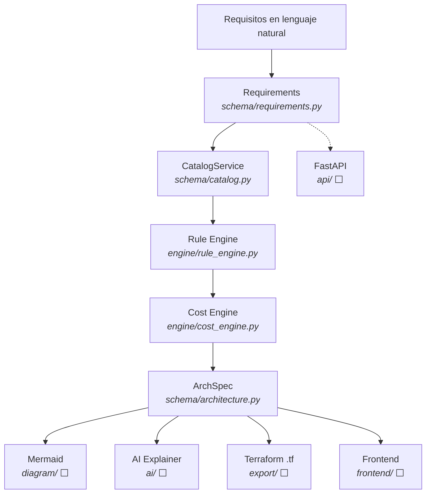
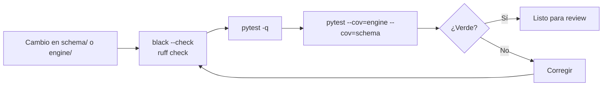

<div align="center">

# InfraWise

### FinOps & Cloud Architecture Advisor

**Convierte requisitos de negocio en una arquitectura Cloud justificable, reproducible y con costo estimado.**

[](ROADMAP.md)
[](pyproject.toml)
[](ROADMAP.md)
[](ROADMAP.md)
[](ROADMAP.md)
[](engine/rule_engine.py)
[](tests/)

</div>

---

**InfraWise** es un motor determinista que convierte los requisitos de una aplicación —usuarios, tráfico, motor de base de datos, disponibilidad, presupuesto y optimización— en una **arquitectura Cloud concreta**, con costo mensual estimado, conexiones, un score explicable y una justificación por cada componente.

Cada capa vive en su propio módulo Python —esquema, motor de reglas, motor de costos— y se comunican únicamente mediante **modelos tipados** (`Requirements`, `CatalogService`, `ArchSpec`). Sin llamadas de red, sin SDK de proveedor, sin aleatoriedad: la misma entrada produce siempre la misma salida.

> **Importante:** este es un proyecto de aprendizaje en fase temprana. La arquitectura nombrada en el roadmap todavía no está construida; el README documenta lo que **realmente corre hoy** y separa explícitamente lo pendiente.

---

## Índice

- [Qué problema resuelve](#qué-problema-resuelve)
- [El objetivo](#el-objetivo)
- [Qué incluye](#qué-incluye)
- [Estructura del proyecto](#estructura-del-proyecto)
- [Arquitectura](#arquitectura)
- [Flujo operativo](#flujo-operativo)
- [Tecnologías](#tecnologías)
- [Seguridad](#seguridad)
- [Salidas y observabilidad](#salidas-y-observabilidad)
- [Testing](#testing)
- [Instalación](#instalación)
- [Uso rápido](#uso-rápido)
- [Ejemplo real](#ejemplo-real)
- [Estado del proyecto](#estado-del-proyecto)
- [Configuración](#configuración)
- [Documentación](#documentación)
- [Contacto](#contacto)

---

## Qué problema resuelve

Diseñar infraestructura Cloud no es elegir "lo mejor". Es una restricción mutua entre cinco variables que rara vez se optimizan juntas:

```text
Costo  +  Escalabilidad  +  Disponibilidad  +  Seguridad  +  Complejidad Operativa
                            ↓
                    ¿Qué arquitectura?
```

En la práctica esto produce dos extremos:

| Problema | Qué pasa |
| :--- | :--- |
| **Sobredimensionado** | Se despliega Kubernetes para una API de 500 usuarios porque "es lo que se usa". El costo y la complejidad no lo justifican. |
| **Subdimensionado** | Una sola instancia EC2 porque "es solo un MVP". Funciona hasta que cae, y con ella la base de datos. |

InfraWise parte de una premisa explícita:

> **La mejor arquitectura no es la más grande ni la más moderna. Es la que tiene sentido para los requisitos, la escala y las restricciones del sistema.**

El motor no optimiza una dimensión: **filtra** el catálogo por las restricciones duras (capacidad, disponibilidad, presupuesto) y luego elige, dentro de lo técnicamente viable, **la opción más barata**.

---

## El objetivo

Demostrar que un motor de arquitectura Cloud puede ser:

- **Determinista** — misma entrada, mismo `ArchSpec`. El `id` es un SHA-256 de los requisitos más los componentes, no un UUID aleatorio.
- **Puro** — sin red, sin IA, sin I/O. El dominio se prueba con `assert`, no con mocks.
- **Explicable** — cada componente trae una `Decision` con su razonamiento y sus factores.
- **Fiel al presupuesto** — nunca devuelve una arquitectura que exceda el presupuesto mensual declarado. Si no alcanza, lo dice y por cuánto.

---

## Qué incluye

```text
┌───────────────────────────────────────────────────────────────┐
│                    PROJECT HIGHLIGHTS                        │
├──────────────┬──────────────┬──────────────┬──────────────────┤
│ Pydantic     │ Determinista │ 11 servicios│ 6 categorías     │
│ schemas      │ rule engine  │ catálogo AWS│ de componentes   │
├──────────────┼──────────────┼──────────────┼──────────────────┤
│ 3 modelos    │ Presupuesto  │ ScoreCard    │ 20 tests         │
│ de precio    │ validado     │ explicable   │ 96% coverage     │
└──────────────┴──────────────┴──────────────┴──────────────────┘
```

### Esquema — `schema/`

Modelos Pydantic que son el contrato de todo el sistema.

- **`Requirements`** — la entrada. Deliberadamente **agnóstico del proveedor**: no menciona AWS, EC2 ni RDS. Ese mapeo es trabajo del Rule Engine, y mantener la frontera hace que "agregar GCP después" sea aditivo y no una reescritura.
- **`CatalogService`** — una opción de servicio normalizada, con su modelo de precio, su precio base mensual, su precio unitario opcional y sus límites de capacidad declarados.
- **`ArchSpec`** — el artefacto único que recorre el sistema. Es una **instantánea inmutable**: incluye una copia de los requisitos que la produjeron, así que siempre se puede responder *"¿qué recomendamos el 3 de marzo y por qué?"*.

| Tipo | Rol |
| :--- | :--- |
| `Requirements` | Entrada: 9 campos validados por Pydantic |
| `CatalogService` | Fila del catálogo: precio, capacidad, disponibilidad mínima |
| `ArchSpec` | Salida: componentes, conexiones, decisiones, score, costo total |
| `Component` | Un recurso con `count`, `config` y costo estimado |
| `Connection` | Una arista `source → target` con etiqueta (`HTTP`, `reads/writes`) |
| `Decision` | La justificación de un componente, con sus `factors` |
| `ScoreCard` | Los 5 ejes de evaluación de la arquitectura |

### Motor de costos — `engine/cost_engine.py`

Una función pura, sin I/O ni dependencia de SDK:

```python
estimate_cost(service: CatalogService, count: int = 1, size_gb: float | None = None) -> float
```

| Modelo de precio | Cálculo | Ejemplo en el catálogo |
| :--- | :--- | :--- |
| `flat_monthly` | `base_monthly_usd * count` | ALB `$16.00` |
| `instance_hour` | `base_monthly_usd * count` (ya normalizado a mensual) | EC2 t3.small `$15.18` |
| `per_unit` | `unit_price_usd * size_gb * count` | S3 Standard `$0.023/GB` |

Un error de catálogo **falla de forma explícita** en lugar de convertirse en costo cero: `per_unit` sin `size_gb` lanza `ValueError`, y `per_unit` sin `unit_price_usd` lanza `CostCatalogError`. El resultado se redondea a centavos para mantener una salida estable.

### Motor de reglas — `engine/rule_engine.py`

El cerebro determinista. Tres funciones públicas:

```python
filter_catalog(catalog, category, req) -> list[CatalogService]   # restricciones duras
pick_cheapest(candidates, count=1)  -> CatalogService            # menor costo viable
recommend(req, catalog)             -> ArchSpec                  # la arquitectura completa
```

**Filtro (restricciones duras, no preferencias):**

- `provider == "aws"` — hardcodeado en v1, a propósito.
- La categoría coincide.
- `min_availability` del servicio es compatible con el nivel pedido, usando una tabla ordenada `standard < high < critical` — **no** una cadena de `if`, y **no** comparación lexicográfica de strings.
- `max_rpm >= req.requests_per_minute` y `max_users >= req.monthly_active_users`, cuando el servicio los declara. S3 y ALB no los declaran, y eso es intencional.

> **Matiz importante para `HIGH`:** compute stateless se vuelve altamente disponible con dos instancias, y storage/cache/CDN administrados aceptan la garantía del catálogo. Pero **database y load_balancer deben declarar `HIGH` explícitamente** — es la razón por la que `availability=high` fuerza RDS Multi-AZ en lugar de aceptar la single-AZ por ser más barata.

**Reglas de inclusión de categorías:**

| Categoría | Se incluye cuando |
| :--- | :--- |
| `compute` | siempre |
| `database` | `req.database != none` |
| `storage` | `req.storage_gb > 0` |
| `load_balancer` | `availability != standard` **o** el compute necesita `count > 1` |
| `cache` | `req.optimize_for == performance` |
| `cdn` | `req.app_type == static_site` |

**Presupuesto como restricción, no como sugerencia:** el motor acumula el costo de cada opción mínima viable y lanza `NoViableArchitecture` nombrando la categoría que rompió el presupuesto y el saldo restante. El único resultado permitido es un `ArchSpec` dentro del presupuesto o un error explicable — nunca un tercero.

**ScoreCard**, con heurísticas simples y documentadas:

| Eje | Regla |
| :--- | :--- |
| `cost_usd_month` | Suma de los componentes seleccionados |
| `complexity` | `LOW` ≤2 categorías · `MEDIUM` 3–4 · `HIGH` 5+ |
| `scalability` | `HIGH` si el compute tiene ≥2× de margen entre `max_rpm` y el tráfico pedido |
| `availability_pct` | `99.5` standard · `99.9` high · `99.99` critical |
| `operational_overhead` | Cuenta los servicios que requieren mantenimiento manual (hoy, EC2) |

### Catálogo de ejemplo

`examples/catalog.aws.sample.json` — 11 servicios AWS con precios de lista on-demand de `us-east-1` (2026), convertidos a mensual con 730 h/mes.

| Servicio | Categoría | $/mes | RPM máx | Usuarios máx | Disponibilidad mín. |
| :--- | :--- | :--- | :--- | :--- | :--- |
| EC2 t3.micro | compute | 7.59 | 500 | 1 000 | standard |
| EC2 t3.small | compute | 15.18 | 1 500 | 5 000 | standard |
| EC2 t3.medium | compute | 30.37 | 4 000 | 15 000 | standard |
| ElastiCache Redis t3.micro | cache | 12.41 | — | — | standard |
| RDS PostgreSQL db.t3.micro | database | 15.00 | 800 | 2 000 | standard |
| RDS PostgreSQL db.t3.small | database | 30.00 | 2 000 | 8 000 | standard |
| RDS PostgreSQL db.t3.small (Multi-AZ) | database | 60.00 | 2 000 | 8 000 | **high** |
| RDS PostgreSQL db.t3.medium (Multi-AZ) | database | 120.00 | 5 000 | 20 000 | **high** |
| S3 Standard | storage | 0.023 /GB | — | — | standard |
| Application Load Balancer | load_balancer | 16.00 | — | — | **high** |
| CloudFront | cdn | 0.085 /GB out | — | — | standard |

---

## Estructura del proyecto

```text
InfraWise/
├── .gitignore                     # .venv, caches, .coverage, .env
├── pyproject.toml                 # Dependencias, pytest, ruff, black
├── uv.lock                        # Grafo de dependencias fijado
├── README.md
├── ROADMAP.md                     # Fases 0–5, cada una con milestone
├── PHASE1_REPORT.md               # Evidencia de la Fase 1 (tests, cobertura, decisiones)
│
├── schema/                        # ✅ CONTRATOS DEL DOMINIO
│   ├── requirements.py            # Requirements + 4 enums
│   ├── catalog.py                 # CatalogService, PricingModel, ComponentCategory
│   └── architecture.py            # ArchSpec, Component, Connection, Decision, ScoreCard
│
├── engine/                        # ✅ MOTOR PURO
│   ├── cost_engine.py             # estimate_cost()
│   └── rule_engine.py             # filter_catalog(), pick_cheapest(), recommend()
│
├── examples/                      # ✅ FIXTURES VERIFICADOS
│   ├── catalog.aws.sample.json    # 11 servicios AWS
│   ├── requirements.example.json  # la entrada de ejemplo
│   ├── architecture.example.json  # el golden fixture ($107.51)
│   └── _generate_examples.py      # regenera los fixtures (solo stdlib)
│
├── tests/                         # ✅ 20 TESTS, 96% COVERAGE
│   ├── test_cost_engine.py        # los 3 modelos de precio + casos borde
│   └── test_rule_engine.py        # golden fixture, reglas, property test
│
├── api/main.py                    # ⬜ FASE 2 — FastAPI (vacío)
├── diagram/mermaid.py             # ⬜ FASE 2 — ArchSpec → Mermaid (vacío)
├── ai/
│   ├── base.py                    # ⬜ FASE 3 — AIExplainer Protocol (vacío)
│   ├── ollama_provider.py         # ⬜ FASE 3 — Ollama local (vacío)
│   └── template_provider.py       # ⬜ FASE 3 — fallback sin red (vacío)
├── export/terraform.py            # ⬜ FASE 5 — ArchSpec → .tf (vacío)
├── frontend/                      # ⬜ FASE 4 — Next.js (vacío)
├── Dockerfile                     # ⬜ FASE 2 (vacío)
├── docker-compose.yml             # ⬜ FASE 2 (vacío)
└── .github/workflows/ci.yml       # ⬜ FASE 5 (vacío)
```

> ✅ construido y probado · ⬜ módulo reservado, aún vacío

---

## Arquitectura

El `ArchSpec` es el único contrato entre etapas. Cada etapa **lo lee y devuelve uno nuevo, más completo**. Ninguna lo muta en sitio, ninguna recalcula requisitos ni vuelve a elegir servicios desde cero.



### Por qué un artefacto y no varios

Esa inmutabilidad es lo que después hace triviales dos cosas:

- **Diff "antes vs. después" de una optimización** — `ArchSpec` v1 contra v2, misma familia de `id`.
- **Historial de auditoría** — el `ArchSpec` viejo y sus requisitos nunca cambiaron, así que la recomendación es siempre reconstruible.

### Pipeline de calidad



---

## Flujo operativo

### Aprovisionamiento del dominio

```text
Requisitos → filter_catalog → pick_cheapest → Cost Engine → ArchSpec
```

### Verificación tras el recommend

```text
ArchSpec.id                      → identificador estable y reproducible
ArchSpec.total_monthly_cost_usd  → costo mensual de la arquitectura
ArchSpec.score                   → los 5 ejes, en una sola línea
ArchSpec.decisions               → por qué cada componente
```

### Depuración de una recomendación

```text
filter_catalog(catalog, ComponentCategory.DATABASE, req)  → ¿qué sobrevivió al filtro?
```

Si la lista viene vacía o incompleta, el problema está en los requisitos (capacidad o disponibilidad), no en el selector. Es el primer paso de debugging más útil del motor.

---

## Tecnologías

| Tecnología | Uso |
| :--- | :--- |
| Python `>=3.11,<3.13` | Lenguaje base. `StrEnum` y `datetime.UTC` exigen 3.11+. |
| Pydantic `>=2.7,<3` | Validación y serialización de los 4 modelos del dominio. |
| Pytest `>=8,<9` | Suite de 20 tests, incluido un property test con semilla fija. |
| Pytest-cov `>=5,<6` | Reporte de cobertura de `engine` y `schema`. |
| Ruff `>=0.6,<1` | Lint. Reglas `E`, `F`, `I`, `UP`, `B`. Línea de 100. |
| Black `>=24,<26` | Formato. Línea de 100, `py311`. |
| Hatchling | Build backend del paquete `infrawise`. |
| uv | Gestión de entorno y lockfile. |
| FastAPI | ⬜ Fase 2 — exponer el motor por HTTP |
| Ollama | ⬜ Fase 3 — redactar las `decisions` con un modelo local |
| Next.js + React Flow | ⬜ Fase 4 — formulario y editor visual de arquitecturas |
| Terraform | ⬜ Fase 5 — exportar el `ArchSpec` a `.tf` |

> Las dependencias de runtime son **una sola**: `pydantic`. Todo lo demás es calidad o infraestructura. Esa es la consecuencia directa de mantener el dominio sin red.

---

## Seguridad

- **Sin llamadas de red en el dominio.** `engine/` y `schema/` no importan ningún SDK de AWS, ni `boto3`, ni `requests`. Eso elimina de raíz la clase de problemas donde un test necesita credenciales o una red inestable.
- **Sin secretos en el repositorio.** `.env` y `.env.*` están en `.gitignore` (con `!.env.example` como excepción explícita). No hay claves, tokens ni credenciales AWS en el código.
- **Contraseñas y datos sensibles como `SecretStr`.** Cuando la Fase 4 exponga la API, los campos de contraseña se tipan como `SecretStr` para que Pydantic los redacte en logs y en `model_dump()`.
- **`CORS` sin comodines en producción.** La Fase 4 documenta explícitamente que `allow_origins=["*"]` no se usa contra un dominio desplegado.
- **Sin datos personales de usuarios.** El modelo `Requirements` describe una aplicación, nunca a una persona. No hay PII en la base de datos.
- **Presupuesto como puerta de seguridad.** Una arquitectura que excede el presupuesto declarado nunca se devuelve, ni siquiera "por si acaso". El error nombra la categoría y el faltante.
- **Catálogo como datos, no como código.** Agregar un servicio o cambiar un precio es editar un JSON versionado y auditable, no desplegar código.

---

## Salidas y observabilidad

`ArchSpec` es a la vez la salida y el registro de auditoría. Para inspeccionar una decisión sin pasar por el `recommend()` completo, llama al filtro directamente:

```python
# ¿Qué servicios de base de datos sobreviven al filtro con estos requisitos?
import json
from pathlib import Path

from engine.rule_engine import filter_catalog
from schema.catalog import CatalogService, ComponentCategory
from schema.requirements import Requirements

EXAMPLES = Path("examples")
catalog = [
    CatalogService.model_validate(item)
    for item in json.loads((EXAMPLES / "catalog.aws.sample.json").read_text(encoding="utf-8"))
]
req = Requirements.model_validate(
    json.loads((EXAMPLES / "requirements.example.json").read_text(encoding="utf-8"))
)

print([c.id for c in filter_catalog(catalog, ComponentCategory.DATABASE, req)])
# ['aws.rds.postgres.t3.small.multiaz', 'aws.rds.postgres.t3.medium.multiaz']
```

Esa lista es la explicación completa de por qué la base de datos no puede ser single-AZ: `availability=high` eliminó las dos opciones `standard` antes de que el selector de precio llegara a evaluarlas. Si la lista viniera vacía, el problema está en los requisitos — no en el selector.

Para el resto del sistema:

```bash
pytest -q                                              # estado del dominio
pytest --cov=engine --cov=schema --cov-report=term-missing   # cobertura línea por línea
ruff check .                                          # lint
black --check .                                       # formato
```

`created_at` registra el momento en que se creó la instantánea; el `id` es un hash del contenido. Son deliberadamente independientes: el mismo contenido genera el mismo `id` aunque se genere en otra fecha.

---

## Testing

20 tests, 0.36 s, 96 % de cobertura sobre 241 statements. La validación es local, instantánea y **no requiere credenciales de AWS**.

```bash
uv run --extra dev pytest --cov=engine --cov=schema --cov-report=term-missing -q
```

| Archivo | Qué cubre |
| :--- | :--- |
| `tests/test_cost_engine.py` | Los 3 modelos de precio, `count <= 0`, `per_unit` sin `size_gb`, `per_unit` sin `unit_price_usd`. |
| `tests/test_rule_engine.py` | Golden fixture, filtro por capacidad/disponibilidad, selección más barata, las 6 categorías, conexiones, cache/CDN, presupuesto insuficiente, catálogo insuficiente para `CRITICAL`, property test. |

Tres pruebas merecen atención porque son la especificación ejecutable del dominio:

```text
test_matches_example_fixture
    Compara componentes {service_id, category, count} contra architecture.example.json
    — NO los costos exactos, que se mueven si se ajustan precios del catálogo.

test_never_exceeds_budget_for_valid_random_inputs
    50 Requirements aleatorios con semilla fija (20260928): o devuelve un ArchSpec
    dentro del presupuesto, o lanza NoViableArchitecture. Nunca un tercer resultado.

test_critical_availability_reports_catalog_gap
    availability=critical con un catálogo que solo llega a "high" debe dar un error
    de "catálogo insuficiente" — no un KeyError genérico.
```

La semilla fija es lo que hace que CI sea determinista: 50 casos property-based sin flakiness.

---

## Instalación

**Requisitos:** Python `3.11` o `3.12`, y [uv](https://docs.astral.sh/uv/).

```bash
git clone <tu-url-del-repo>.git
cd InfraWise
uv sync --extra dev       # crea .venv, instala pydantic + herramientas de calidad
```

> `uv.lock` fija el grafo de dependencias completo. Se commitea a propósito: es lo que garantiza que tu máquina, CI y un despliegue futuro ejecuten exactamente las mismas versiones.

<details>
<summary>Alternativa sin uv</summary>

```bash
python -m venv .venv
# Windows
.venv\Scripts\activate
# macOS / Linux
source .venv/bin/activate

pip install -e ".[dev]"
```
</details>

---

## Uso rápido

```bash
# 1. Ejecuta la suite
uv run --extra dev pytest -q

# 2. Regenera y valida los fixtures del ejemplo
uv run python examples/_generate_examples.py
#   → OK — total_monthly_cost_usd=107.51 (budget=150)

# 3. Quality gates antes de abrir un PR
uv run --extra dev ruff check .
uv run --extra dev black --check .
```

Y para tu propia entrada, la superficie real del motor cabe en un archivo de 20 líneas — `playground.py`:

```python
import json
from pathlib import Path

from engine.rule_engine import recommend
from schema.catalog import CatalogService
from schema.requirements import Requirements

EXAMPLES = Path("examples")
catalog = [
    CatalogService.model_validate(item)
    for item in json.loads((EXAMPLES / "catalog.aws.sample.json").read_text(encoding="utf-8"))
]

spec = recommend(
    Requirements(
        app_type="web_api",
        monthly_active_users=5000,
        requests_per_minute=300,
        database="postgresql",
        storage_gb=50,
        availability="high",
        monthly_budget_usd=150,
    ),
    catalog,
)

print(spec.id, spec.total_monthly_cost_usd)      # archspec-341170a3e023 107.51
for c in spec.components:
    print(f"  {c.id:11} {c.display_name:38} x{c.count}  ${c.estimated_monthly_cost_usd}")
for d in spec.decisions:
    print(f"  {d.component_id}: {d.reasoning}")
```

```bash
uv run python playground.py
```

Los dos únicos puntos de entrada del dominio son `recommend()` y `filter_catalog()`. No hay más superficie que aprender hasta la Fase 2.

> No hay `terraform apply` todavía: la exportación a `.tf` es la Fase 5. Hoy el único "despliegue" es producir y verificar un `ArchSpec`.

---

## Ejemplo real

Entrada — `examples/requirements.example.json`:

```json
{
  "app_type": "web_api",
  "monthly_active_users": 5000,
  "requests_per_minute": 300,
  "database": "postgresql",
  "storage_gb": 50,
  "availability": "high",
  "monthly_budget_usd": 150,
  "region": "us-east-1",
  "optimize_for": "balanced"
}
```

Salida de `recommend()` — verificada ejecutando el motor:

```text
id:     archspec-341170a3e023
total:  $107.51 /mes   (presupuesto: $150 → 28% de margen)

  lb-1        Application Load Balancer               x1    $16.00
  api-1       EC2 t3.small                            x2    $30.36
  db-1        RDS PostgreSQL db.t3.small (Multi-AZ)   x1    $60.00
  storage-1   S3 Standard                             x1     $1.15

  lb-1 -> api-1       (HTTP)
  api-1 -> db-1       (reads/writes)
  api-1 -> storage-1  (reads/writes)

score: complexity=medium  scalability=high
       availability=99.9%  operational_overhead=medium
```

Tres decisiones que explican el resultado:

```text
1. DOS t3.small, no un t3.medium
   Mismo costo por capacidad práctica que un t3.medium ($30.36 vs $30.37),
   pero availability=high prohíbe el punto único de falla. Con el LB ya
   presente, la segunda instancia es redundancia, no capacidad desperdiciada.

2. RDS Multi-AZ, no single-AZ
   Es la única categoría donde HIGH no es negociable: el catálogo declara
   min_availability="high" en la variante Multi-AZ. db.t3.medium quedaría
   sobrada a 5 000 usuarios / 300 rpm, así que se elige la más barata
   que cumple → $60 de ahorro frente a la opción siguiente.

3. El presupuesto nunca se excede
   Con monthly_budget_usd=10 el motor responde:
   "compute mínimo viable cuesta $30.36, pero solo quedan $10.00 de
    presupuesto tras ninguna categoría"

   Con availability=critical, sin catálogo que lo soporte:
   "catálogo insuficiente: no hay servicio compute viable para
    availability=critical, usuarios=5000 y rpm=300"
```

Ese último mensaje es el que la futura API convierte en `422` con una sugerencia accionable, en lugar de un `500` genérico.

---

## Estado del proyecto

**Fase 1 de 5 completada.** El núcleo de dominio está construido, probado y documentado.

| Fase | Alcance | Estado |
| :--- | :--- | :--- |
| 0 — Esquema | `Requirements`, `CatalogService`, `ArchSpec`, catálogo AWS, golden fixture | ✅ Hecho |
| 1 — Rule Engine + Cost Engine | `recommend()` puro, determinista y testeado | ✅ Hecho — ver [`PHASE1_REPORT.md`](PHASE1_REPORT.md) |
| 2 — API + diagrama | FastAPI, persistencia, `ArchSpec` → Mermaid, Docker Compose | ⬜ Pendiente |
| 3 — IA local | `AIExplainer` Protocol, provider Ollama, fallback de plantillas | ⬜ Pendiente |
| 4 — Frontend | Next.js, formulario, diagrama interactivo, demo pública | ⬜ Pendiente |
| 5 — CI/CD + Terraform export | Workflow de GitHub Actions, `ArchSpec` → `.tf` | ⬜ Pendiente |

> **Honestidad sobre "FinOps":** hoy no hay FinOps real. No hay ingesta de datos de consumo, ni rightsizing basado en métricas, ni forecasting. Lo que existe es un **estimador de costo declarativo** sobre precios de catálogo: la arquitectura se evalúa contra los requisitos que el usuario declara, no contra telemetría de producción. El término "FinOps" describe la dirección del proyecto, no lo que ya sabe hacer. Esto está también anotado en el [ROADMAP](ROADMAP.md#roadmap-v2--stretch--documentado-no-bloqueante).

**Módulos aún vacíos** — existen como marcadores de posición, no como funcionalidad:

```text
api/main.py · diagram/mermaid.py · ai/base.py · ai/ollama_provider.py
ai/template_provider.py · export/terraform.py · frontend/ · Dockerfile
docker-compose.yml · .github/workflows/ci.yml
```

---

## Configuración

El motor no lee variables de entorno ni archivos de configuración: **los requisitos son su única entrada**. Esto es deliberado, y es lo que hace que sea trivial de testear y de reproducir.

| Campo de `Requirements` | Tipo | Por defecto | Restricción |
| :--- | :--- | :--- | :--- |
| `app_type` | `web_api` · `web_app` · `static_site` · `background_worker` | — | — |
| `monthly_active_users` | `int` | — | `> 0` |
| `requests_per_minute` | `int` | — | `> 0` |
| `database` | `postgresql` · `mysql` · `none` | `postgresql` | — |
| `storage_gb` | `float` | — | `>= 0` |
| `availability` | `standard` · `high` · `critical` | `standard` | — |
| `monthly_budget_usd` | `float` | — | `> 0` |
| `region` | `str` | `us-east-1` | — |
| `optimize_for` | `cost` · `performance` · `availability` · `simplicity` · `balanced` | `balanced` | — |

Las variables de **entorno** aparecen recién en fases posteriores, y cada una tiene un valor por defecto que hace que la app funcione sin configurarla:

| Variable | Fase | Por defecto | Propósito |
| :--- | :--- | :--- | :--- |
| `DATABASE_URL` | 2 | `sqlite:///./infrawise.db` | PostgreSQL de arquitecturas guardadas |
| `AI_PROVIDER` | 3 | `ollama` | Selecciona el provider de explicaciones |

### Ajustar el catálogo

El catálogo es **datos, no código**. Para cambiar precios o agregar servicios, edita `examples/catalog.aws.sample.json` y regenera:

```bash
uv run python examples/_generate_examples.py
```

`base_monthly_usd` es **siempre un valor mensual**, incluso para precios por hora. Esa es la regla que impide que el motor mezcle tarifas horarias y mensuales por accidente. Para un servicio `instance_hour`, calcula `precio_por_hora * 730` y redondea a centavos.

Si agregas un servicio, el test dorado `test_matches_example_fixture` seguirá pasando mientras la selección no cambie; si cambia, actualiza `examples/architecture.example.json` a mano y confirma que el total sigue dentro del presupuesto.

---

## Documentación

| Archivo | Contenido |
| :--- | :--- |
| [`README.md`](README.md) | Este documento. |
| [`ROADMAP.md`](ROADMAP.md) | Fases 0–5 con milestones, tareas y definiciones de hecho. |
| [`PHASE1_REPORT.md`](PHASE1_REPORT.md) | Evidencia de la Fase 1: cambios, justificación, comandos ejecutados y pendientes. |
| [`schema/requirements.py`](schema/requirements.py) | La entrada del sistema y sus 4 enums. |
| [`schema/catalog.py`](schema/catalog.py) | `CatalogService`, `PricingModel`, `ComponentCategory`. |
| [`schema/architecture.py`](schema/architecture.py) | `ArchSpec` y sus 4 submodelos. |
| [`engine/cost_engine.py`](engine/cost_engine.py) | `estimate_cost()` y los 3 modelos de precio. |
| [`engine/rule_engine.py`](engine/rule_engine.py) | `filter_catalog()`, `pick_cheapest()`, `recommend()`. |
| [`tests/`](tests/) | La especificación ejecutable del dominio. |
| [`examples/`](examples/) | Catálogo, requisitos y golden fixture. |
| [`pyproject.toml`](pyproject.toml) | Dependencias y configuración de pytest, ruff y black. |

---

## Contacto

Si tienes alguna pregunta o feedback, ¡no dudes en escribirme!

- **Correo:** [gonzalezleyver6@gmail.com](mailto:gonzalezleyver6@gmail.com)
- **LinkedIn:** [Leyver Aaron Gonzalez Mendoza](https://www.linkedin.com/in/leyver-aaron-gonzalez-mendoza-7026a73a8/)

---

<div align="center">

**InfraWise**

*FinOps & Cloud Architecture Advisor*

`Python · Pydantic · Deterministic Engine · FastAPI · Ollama · Terraform`

*Fase 1 de 5 — núcleo de dominio construido y verificado*

</div>
